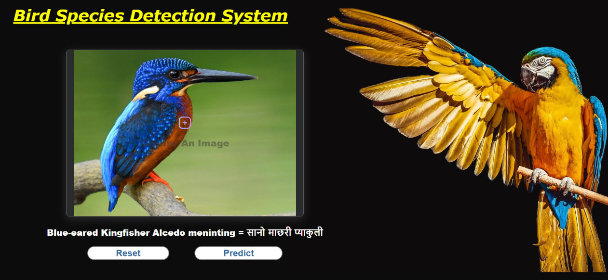

# Nepal Endangered Bird Species Detection Using Convolutional Neural Networks (CNN) and Flask

A deep learning web application for detecting and classifying bird species from images. This project combines a Convolutional Neural Network (CNN) trained on a curated dataset of birds with a Flask backend and a responsive frontend to provide users with real-time bird species identification.

### Project Overview

This application enables users to:
- Upload a bird image via a web interface.
- Get instant prediction of the bird species using a trained CNN.
- Get the bird species name in devanagari format
- View the predicted result directly on the frontend.
- Reset and upload new images as needed.
  
### Supported Bird Species

The model is trained to recognize the following bird species:

- Abbott’s Babbler Malacocincla abbotti = मोटोठूँडे भ्याकुरमोटोठूँडे भ्याकुर
- Black Bittern (Dupetor flavicollis) = कालो जूनबकुल्ला 
- Chestnut Munia Lonchura atricapilla = कोटेरो मुनियाँ 
- Cinereous Vulture Aegypius monachus = राज गिद्ध  
- Gould’s Shortwing Brachypteryx stellata = थोप्ले लघुपंख 
- Upto 38 Endangered Species

### Technologies Used

- **Frontend**: HTML, CSS, JavaScript  
- **Backend**: Python Flask  
- **Model**: Convolutional Neural Network (CNN)  
- **Others**: TensorFlow, Keras, NumPy, OpenCV  

### Dependencies:
1. Python 3.x
2. PyTorch
3. Flask
4. NumPy
5. Scikit-learn
6. Matplotlib

### Project structure:
  project-name/
│── backend/            # Flask backend code
│   ├── apps.py          # Helper functions
│── frontend/            # Frontend code
│   ├── index.html
│   ├── parrot-3601194_1280.jpg
│   ├── pds.js
│   ├── plus.png
│   ├── style.css
│── README.md           # Project overview and instructions
│── output.png          # FInal demo-output
  

### Dataset
- Trained on 8073 images of 38 different species 
- labeled with unique identifier, mapped to both devanagari(Nepali) and Scientific names 

### Functionality
- **Image Upload**  
  1. Allows users to select an image via file input.
  2. Displays the image using `background-image` styling.
  3. Saves image preview using `localStorage` for persistence.
- **Auto-poolling Prediction**
  1. JavaScript polls the Flask backend `(/get_text)` every 2 seconds
  2. Displays updated predictions dynamically.
  3. Stores predictions in `localStorage` for a consistent experience.
- **Reset Button**
  1. Sends a `DELETE` request to `/delete-image` in Flask backend.
  2. Removes stored image from the backend.
  3. Clears `localStorage` data for a clean start

### Demo Page


### Limitations
1. The model is limited to the current dataset of 38 species
2. Performance drops on low-quality or obstructed images
3. No support yet for multi-bird detection or localization


### Contribution
We welcome contributions!
You can: 
 - Fork this repo
 - Create feature branches
 - Submit pull requests
 - File issues for bugs or new features

### License
This project is licensed under the MIT License.

## Installation 
1. Installing Dependencies:
```md
pip install pillow torch numpy torchvision matplotlib flask flask-cors
```

2. Clone repository:
   ```bash
   git clone https://github.com/ankritRisal/Nepal_Endangered_bird_species_detection_system.git

